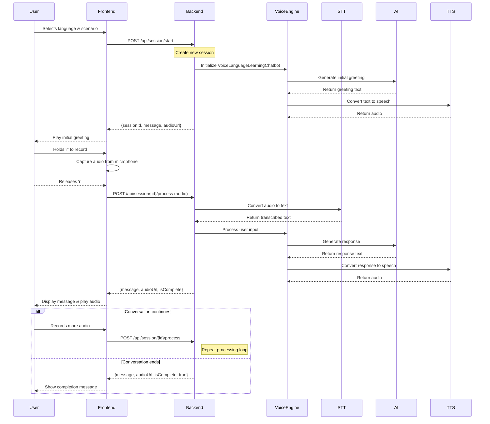

# Sequence Diagram: Frontend-Backend Interaction

## Key Components

### Frontend Responsibilities
1. Capture audio from microphone
2. Send audio to backend for processing
3. Display conversation messages
4. Play audio responses
5. Manage session state

### Backend Responsibilities
1. Create and manage conversation sessions
2. Process audio files (convert format)
3. Handle speech-to-text conversion
4. Generate AI responses
5. Convert text to speech
6. Serve audio files

### Voice Engine (VoiceLanguageLearningChatbot)
1. Maintain conversation context
2. Track scenario progress
3. Handle language learning logic
4. Manage conversation steps